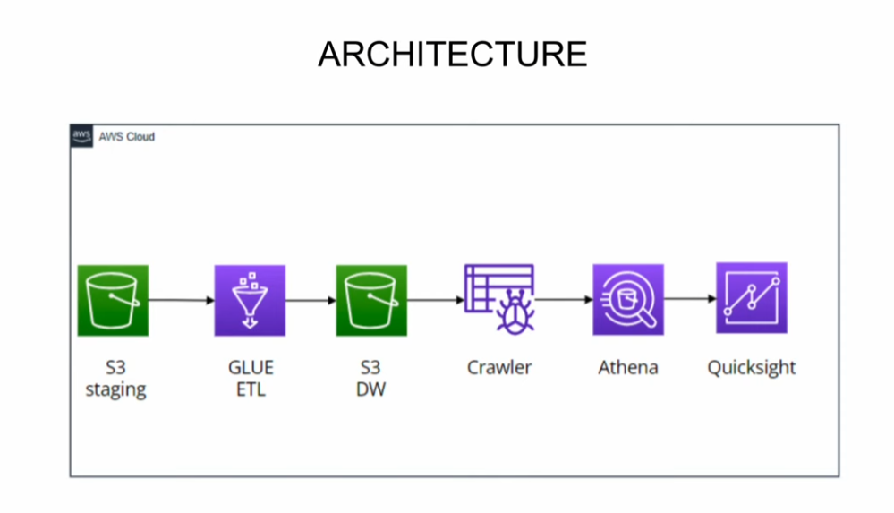

# spotify_data_engineering
This repository contains an end-to-end data engineering project using AWS Cloud and PySpark, from Spotify data information. The project involves extracting Spotify data using APIs, transforming the data with PySpark, storing it in AWS S3, and performing data analysis. The project involves extracting, transforming, and loading Spotify data to build a data pipeline. Key components include:

- Data Extraction: Retrieving Spotify data using APIs.
- Data Transformation: Processing data with PySpark.
- Data Storage: Storing transformed data in AWS S3.
- Data Analysis: Analyzing data using PySpark.

### Technologies Used
- AWS Cloud: S3, IAM
- PySpark
- Python

### Project Structure
- data_extraction/: Scripts for extracting data from Spotify APIs.
- data_transformation/: PySpark scripts for transforming data.
- data_storage/: Configurations for storing data in AWS S3.
- data_analysis/: Notebooks and scripts for analyzing the data.

### Getting Started
To get started with this project, follow the instructions below:

- Clone this repository.
- Set up AWS credentials and configure S3 buckets.
- Install required Python packages.
- Run the data extraction scripts.
- Execute the data transformation pipeline using PySpark.
- Analyze the transformed data using this README.

### Data Used
I'm using data placed on kaggle, created by Tony Gordon Jr. [Spotify Dataset 2023](https://www.kaggle.com/datasets/tonygordonjr/spotify-dataset-2023)

1. albums
2. artists
3. tracks

### Architecture Diagram

### Data Engineering Process

1. `CREATE IAM USER`: On the first step we will create a new user via root account, then login via new IAM user for security measures. [Click here](https://www.youtube.com/watch?v=ubrE4xq9_9c) on how to setup IAM user. Then attaching necessary `direct policies` for this project, that's include S3, Glue, Athena & QuickSight access. And before setting up the account, do review the account before its creation, refer image below.

Once complete, you can signing via IAM account that you just created, which the system will request Account ID number, Username and password. For first time log in, the system will auto asking to change the password accordingly.

2. `CREATE S3 BUCKET`: Go to S3, and create a bucket. As for this project I've named my bucket as `my-spotify-de-project` you can named it whatever you want, do noted each bucket is unique and remembers its purpose.

Then, you can start to create two new folder `staging` and `datawarehouse`.

3. `DOWNLOAD THE DATASET`: Before we begin processing, we must acquired dataset. Usually the data we will fetch from `DynamoDB` or `Database Instance`. But for this project since we outsource the dataset, we will upload it manually.

Get the Dataset [HERE](https://www.kaggle.com/datasets/tonygordonjr/spotify-dataset-2023)

4. `UPLOAD THE DATASET`: For this project, I've upload it inside `staging/` that just created earlier, and selected three files out of five files inside the dataset we retrieve earlier, I've upload Artist, Albums & Tracks. 

References:
-  [Spotify playlist data engineering by Date with Data](https://www.youtube.com/watch?v=yIc5a7C8aHs)
-  [Creating IAM user](https://www.youtube.com/watch?v=ubrE4xq9_9c)
